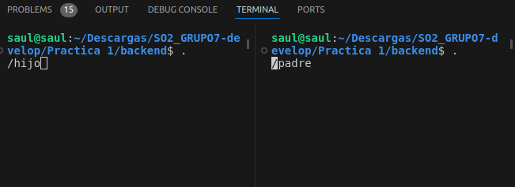
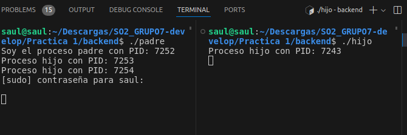
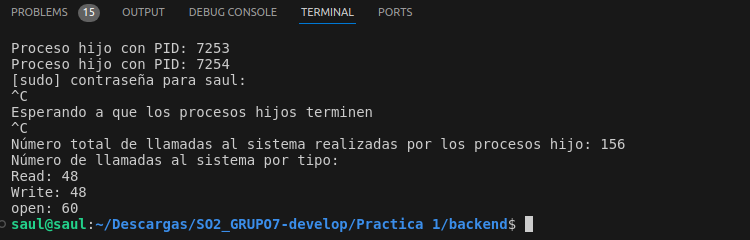
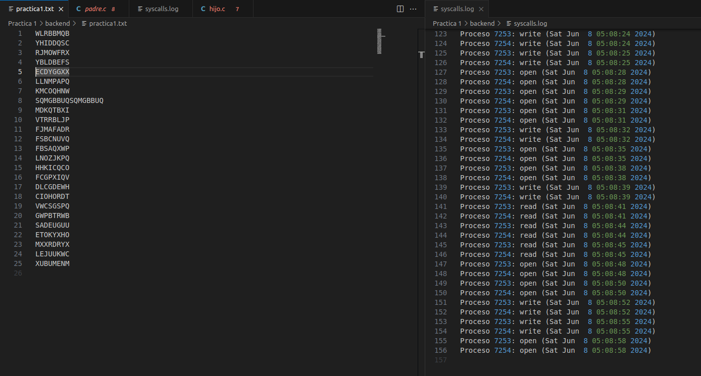

# **Manual Técnico**
##### ***SISTEMAS OPERATIVOS 2***
___

## **INDICE**
- [**RESPONSABLES**](#responsables)
- [**ACERCA DE**](#acerca-de)
- [**CODIGO**](#codigo)
- [**FLUJO DEL PROGRAMA**](#flujo-del-programa)

___
## **RESPONSABLES**

|No.| Nombre | Carnet |
|:-:| ------ | ------ |
|1| Edgardo Andrés Nil Guzmán | 201801119 |
|2| Saúl Jafet Menchú Recinos | 201906444 |
___
## **ACERCA DE**
En este proyecto se detalla la implementación y funcionamiento de un programa desarrollado en `C` para monitorear y registrar las llamadas al sistema realizadas por procesos hijos en un entorno Linux.

___
## **CODIGO**
A continuación se detalla parte del código y las funciones utlizadas dentro del mismo. Para está práctica todo el código fue realizado en lenguaje `C`.
#### Padre
```C
void sigint_handler(int signum) {
    printf("\nNúmero total de llamadas al sistema realizadas por los procesos hijo: %d\n", total_syscalls);
    printf("Número de llamadas al sistema por tipo:\n");
    printf("Read: %d\n", read_syscalls);
    printf("Write: %d\n", write_syscalls);
    printf("open: %d\n", open_syscalls);
    exit(EXIT_SUCCESS);
}
```
Esta función es un manejador para la señal SIGINT, que normalmente se envía al programa cuando el usuario presiona Ctrl+C en el teclado.

```C
void limpiar_archivo_syscalls_log() {
    FILE *file = fopen("syscalls.log", "w");
    if (file == NULL) {
        perror("Error al abrir el archivo syscalls.log");
        exit(EXIT_FAILURE);
    }
    fclose(file);
}
```
Función para limpiar el archivo syscalls.log y, si no existe, crearlo
>Nota: se usó una función similar para asegurar que el archivo syscalls.log existe.

```C
int main{
    ...
    ...
    ...
    char command[100];
    sprintf(command, "%s %d %d %s", "sudo stap tap.stp ", pid1, pid2, " > syscalls.log");
    system(command);

    FILE *file = fopen("syscalls.log", "r");
    if (file == NULL) {
        perror("Error al abrir el archivo syscalls.log");
        exit(EXIT_FAILURE);
    }

    char line[MAX_LINE_LENGTH];
    while (fgets(line, sizeof(line), file) != NULL) {
        actualizar_contadores(line);
    }
    fclose(file);
    return 0;
}
```
Y dentro de la funcion main se encuentran las llamadas a las funciones anteriormente explicadas y otros procesos como: la lectura del archivo syscalls.log y la actualización de los contadores, creación de procesos hijos, ejecuación del script SystemTap para monitorear llamadas al sistema y la espera para que los procesos hijos terminen.

#### Hijo
```C
void write_random_string(int fd, int child_pid) {
    char buffer[9];
    for (int i = 0; i < 8; i++) {
        buffer[i] = random_char();
    }
    buffer[8] = '\n';
    write(fd, buffer, 9);
}
```
Está funcion realiza la escritura aleatoria para el archivo.

```C
int main() {
    int fd = open(FILENAME, O_RDWR | O_CREAT, 0644);
    if (fd == -1) {
        perror("Error al abrir el archivo");
        exit(EXIT_FAILURE);
    }
    limpiar_archivo(FILENAME);
    int child_pid = getpid();
    printf("Proceso hijo con PID: %d\n", child_pid);
    ...
    ...
    ...
}
```
Y dentro del main se hacen las llamadas a las demás funciones.

___

## **FLUJO DEL PROGRAMA**
A continuación se detalla el flujo del programa:

1. Se ejcutan los scripts del `hijo.c` y del `padre.c`.
<p align="center">
  
</p>

2. Se espera a la creación, lectura y escritura en los archivos correspondiente.
<p align="center">
  
</p>

3. Se detiene la ejecuación al esperar un tiempo determinado.
<p align="center">
  
</p>

4. Se revisan los archivo para comprobar la correcta ejecución del programa.
<p align="center">
  
</p>
___