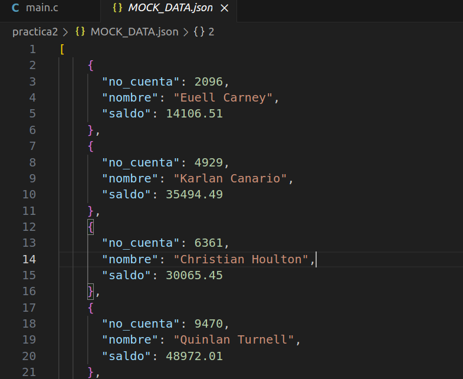
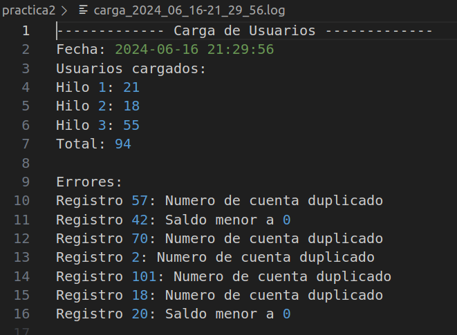
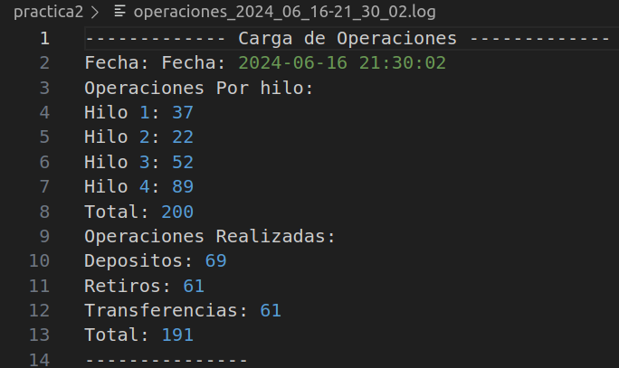
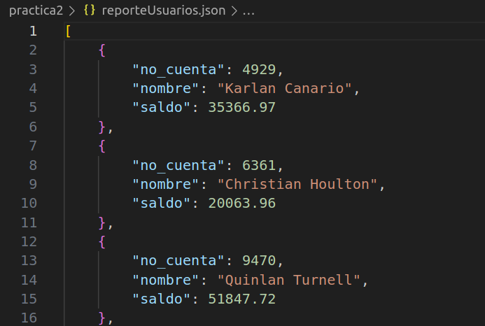

# **Manual Técnico**
##### ***SISTEMAS OPERATIVOS 2***
___

## **INDICE**
- [**RESPONSABLES**](#responsables)
- [**ACERCA DE**](#acerca-de)
- [**CODIGO**](#codigo)
- [**REPORTE DE DATOS**](#reporte-de-datos)

___
## **RESPONSABLES**

|No.| Nombre | Carnet |
|:-:| ------ | ------ |
|1| Edgardo Andrés Nil Guzmán | 201801119 |
|2| Saúl Jafet Menchú Recinos | 201906444 |
___
## **ACERCA DE**
En este proyecto se detalla la implementación y funcionamiento de un programa desarrollado en `C` que permita almacenar los datos de usuario de un banco, así como poder realizar operaciones monetarias como depósitos,
retiros y transacciones. Todo este funcionamiento utilizando principalmente hilos.

___
## **CODIGO**
A continuación se detalla parte del código y las funciones utlizadas dentro del mismo. Para está práctica todo el código fue realizado en lenguaje `C`.
#### Carga Masiva
```C
void cargaMasiva(){
    pthread_t  thread1, thread2, thread3;

    crear_binario();

    pthread_create(&thread1, NULL, leer2, "1");
    pthread_create(&thread2, NULL, leer2, "2");
    pthread_create(&thread3, NULL, leer2, "3");

    pthread_join(thread1, NULL);
    pthread_join(thread2, NULL);
    pthread_join(thread3, NULL);
}
```
Esta función permite carga los datos de usuario de forma masiva por medio de tres hilos paralelamente.

```C
cJSON *count = cJSON_GetObjectItemCaseSensitive(item, "no_cuenta");
cJSON *name = cJSON_GetObjectItemCaseSensitive(item, "nombre");
cJSON *balance = cJSON_GetObjectItemCaseSensitive(item, "saldo");

if (cJSON_IsNumber(count) && cJSON_IsString(name) && cJSON_IsNumber(balance)) {
    
    if((existe("binario.bina", count->valueint))==1){
        u.no_cuenta=count->valueint;
        strncpy(u.nombre, name->valuestring, sizeof(u.nombre) - 1);
        u.nombre[sizeof(u.nombre) - 1] = '\0';
        u.saldo=balance->valuedouble;
        if(u.saldo<0){
            escribir_errores(2,actual);
            continue;
        }
        archivo_binario = fopen("binario.bina","rb+");
        fseek(archivo_binario,0+(36*(actual-1)),SEEK_SET);
        fwrite(&u,sizeof(u),1,archivo_binario);
        fclose(archivo_binario);
    }
}
```
En esta explica la lectura y almacenamiento de registro desde un archivo JSON a uno binario.

<p align="center">
  
</p>

#### Operaciones individuales
```C
void modificarBinario(char opc, int retiro, int deposito, float saldo) {
    FILE *archivo_binario = fopen("binario.bina", "rb+");
    if (archivo_binario == NULL) {
        perror("Unable to open binary file");
        return;
    }
    user u;
    int cuenta1=0;int cuenta2=0;
    int saldo_cuenta1=0; int saldo_cuenta2=0;
    int cont = 0;
    while (fread(&u, sizeof(user), 1, archivo_binario)) {
        if (u.no_cuenta == retiro) {
            if (opc == '1') { // DEPOSITO
                printf("Saldo %.2f + %.2f\n", u.saldo, saldo);
                u.saldo = u.saldo + saldo;
                printf("Nuevo saldo %.2f\n", u.saldo);
                fseek(archivo_binario, -sizeof(user), SEEK_CUR);
                fwrite(&u, sizeof(user), 1, archivo_binario);
                break;
            }
        }
       
    }
    fclose(archivo_binario);

}
```
Para el desarrollo de esta practica y el almacenamiento de los usuarios se utilizo un archivo binarios para almacenar cada registro del json, antes de almacenarlo en el binario se guardo en struct. Por lo tanto esta función muestra parcialmente la lectura del archivo binario y la busqueda de determinado registro para su posterior monejo de informació

>Nota: Se menciona parcilamente ya que esta función puede relizar cuatro distintas operaciones.

```C
int main{
    ...
    ...
    ...
    char command[100];
    sprintf(command, "%s %d %d %s", "sudo stap tap.stp ", pid1, pid2, " > syscalls.log");
    system(command);

    FILE *file = fopen("syscalls.log", "r");
    if (file == NULL) {
        perror("Error al abrir el archivo syscalls.log");
        exit(EXIT_FAILURE);
    }

    char line[MAX_LINE_LENGTH];
    while (fgets(line, sizeof(line), file) != NULL) {
        actualizar_contadores(line);
    }
    fclose(file);
    return 0;
}
```
Y dentro de la funcion main se encuentran las llamadas a las funciones anteriormente explicadas y otros procesos como: la lectura del archivo syscalls.log y la actualización de los contadores, creación de procesos hijos, ejecuación del script SystemTap para monitorear llamadas al sistema y la espera para que los procesos hijos terminen.

#### Otras operaciones
```C
void leerArchivoBinario(int des, int cuenta) {
    FILE *archivo_binario = fopen("binario.bina", "rb");
    
    if(des==1){
        while (fread(&u, sizeof(user), 1, archivo_binario)) {
            if(u.no_cuenta==cuenta){
                printf("-----------------------\n");
                printf("Cuenta: %d\n", u.no_cuenta);
                printf("Nombre: %s\n", u.nombre);
                printf("Saldo: %.2f\n", u.saldo);
                printf("-----------------------\n");
            }        
        }
    }
    fclose(archivo_binario);
}
```
Otras de la operaciones manejas está la lectura de determinado registro brindado por el usuario. Esta función hace una búsqueda en el archivo binario anteriormente descrito, una vez encontrado el registro lo imprimer en pantalla junto con toda su información. De no encontrarse, el programa no muestra nada y continua con su ejecución.


#### **Carga Masiva de Operaciones**

```C
void cargaMasivaOp(){

    cantidad_tran();
    pthread_mutex_init(&lock, NULL);
    pthread_t  thread1, thread2, thread3, thread4;

    pthread_create(&thread1, NULL, leerTransacciones, "1");
    pthread_create(&thread2, NULL, leerTransacciones, "2");
    pthread_create(&thread3, NULL, leerTransacciones, "3");
    pthread_create(&thread4, NULL, leerTransacciones, "4");

    pthread_join(thread1, NULL);
    pthread_join(thread2, NULL);
    pthread_join(thread3, NULL);
    pthread_join(thread4, NULL);
    
    pthread_mutex_destroy(&lock);
}
```
Ejecución de cuatro hilos de manera concurrente usando mutex.

> Nota: Para la lectura de las transacciones se realizó de la misma manera que la lectura de usaurio a diferencia que en esta ocasión no se guardó ni un registro, si no se fueron ejecutando en el mismo momento. Para la ejecuación de cada operacion se realizó de la misma manera para las operaciones individuales.

#### Otras funciones
```C
void obtener_fecha_hora(char *buffer, size_t buffer_size) {
    time_t t = time(NULL);
    struct tm tm = *localtime(&t);
    strftime(buffer, buffer_size, "carga_%Y_%m_%d-%H_%M_%S.log", &tm);
}

void obtener_fecha_hora_formato(char *buffer, size_t buffer_size) {
    time_t t = time(NULL);
    struct tm tm = *localtime(&t);
    strftime(buffer, buffer_size, "Fecha: %Y-%m-%d %H:%M:%S", &tm);
}

void limpiarBufferEntrada() {
    int c;
    while ((c = getchar()) != '\n' && c != EOF);
}
```
Estas funciones son para la obtencia de la fecha actual, el formato para el nomrbre del archivo y limpieza del buffer de entrada para la elección en el menú.

## REPORTE DE DATOS

Reporte para la carga de usuarios
<p align="center">
  
</p>

Reporte para las operaciones realizadas
<p align="center">
  
</p>

Reporte para las cuentas de usuarios
<p align="center">
  
</p>

____