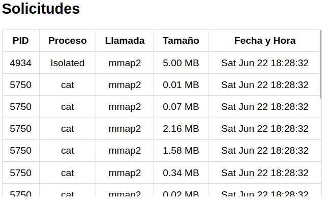

# **Manual Técnico**
##### ***SISTEMAS OPERATIVOS 2***
___

## **INDICE**
- [**RESPONSABLES**](#responsables)
- [**ACERCA DE**](#acerca-de)
- [**CODIGO**](#codigo)
- [**DASHBOARD**](#dashboard)
- [**BASE DE DATOS**](#base-de-datos)

___
## **RESPONSABLES**

|No.| Nombre | Carnet |
|:-:| ------ | ------ |
|1| Edgardo Andrés Nil Guzmán | 201801119 |
|2| Saúl Jafet Menchú Recinos | 201906444 |
___
## **ACERCA DE**
En este proyecto se detalla la implementación y funcionamiento de una apliación que permite monitorear el uso de la memoria en procesos abierto en Linux utilizando un lector con Systemtap en `C`. Además de detectar las solicitudes de memoria que se ralizan en el sistema operativo. Con la información obtenida se puede ver de manera gráfica.

___
## **CODIGO**
A continuación se detalla parte del código y las funciones utlizadas dentro del mismo. Para este proyecto todo el código fue realizado en lenguaje `C` para la solicitud de información, utilizando Systemtap. Y para el Frontend se utilizó React.
#### Lector
En este procedimiento se procede a obtener la información de la memoria total del sistema 
```C
    int memoriaTotalSitema;
    FILE *mem_fp = popen("free -m | awk 'NR==2{print $2}'", "r");
    if (mem_fp == NULL) {
        fprintf(stderr, "Error al abrir el comando 'free'\n");
        exit(1);
    }
    fscanf(mem_fp, "%d", &memoriaTotalSitema);
    pclose(mem_fp);
    
    int memoriaKB = memoriaTotalSitema * 1024;
    
    printf("Memoria total del sistema: %d MB\n", memoriaKB);
```

Luego, utlizando Systemtap se Almacena cada elemento dentro de un struct y por último se inserta la información en la base de datos.

```C
FILE *fp;
char buffer[MAX_BUFFER_SIZE];
fp = popen("sudo ./meminfo.stp", "r");
if (fp == NULL) {
    fprintf(stderr, "Error al abrir el script de SystemTap\n");
    exit(1);
}

while (fgets(buffer, MAX_BUFFER_SIZE, fp) != NULL) {
    if (sscanf(buffer, "PID del proceso: %d", &solicitud.pid) == 1) {
        fgets(buffer, MAX_BUFFER_SIZE, fp);
        sscanf(buffer, "Nombre del proceso: %s", solicitud.proceso);
        fgets(buffer, MAX_BUFFER_SIZE, fp);
        sscanf(buffer, "Llamada: %[^()]s", solicitud.llamada); 
        fgets(buffer, MAX_BUFFER_SIZE, fp);
        sscanf(buffer, "Tamaño del segmento de memoria solicitado: %f", &solicitud.tamano);
        
        solicitud.porcentaje = solicitud.tamano / memoriaKB * 100;
        insertar_DBMS(conn, solicitud);
    }
}

```

Previamente a obtener e insertar los datos, se realizó la conexión a la base de datos
```C
conn = mysql_init(NULL);
if (conn == NULL) {
    fprintf(stderr, "Error al inicializar la conexión MySQL\n");
    exit(1);
}
if (mysql_real_connect(conn, server, user, password, database, 3306, NULL, 0) == NULL) {
    finish_with_error(conn);
}
```
Al finalizar la insercción de datos, se procede a cerrar la conexción.

#### Backend
A continuación se explica el codigo para el backend en python para el manejo y envió de datos almacenados en la bas de datos
```python
def obtener_datos_grafica():
    try:
        conn = mysql.connector.connect(**db_config)
        cursor = conn.cursor()
        query = '''SELECT
                    pid,
                    MIN(proceso) AS proceso,
                    SUM(tamaño_mmap) - SUM(tamaño_munmap) AS memoria_usada
                FROM (
                    SELECT
                        pid,
                        proceso,
                        CASE WHEN llamada = 'mmap2' THEN tamano ELSE 0 END AS tamaño_mmap,
                        CASE WHEN llamada = 'munmap' THEN tamano ELSE 0 END AS tamaño_munmap
                    FROM solicitud
                ) AS subconsulta
                GROUP BY pid, proceso
                ORDER BY memoria_usada DESC'''
        cursor.execute(query)
        rows = cursor.fetchall()

```
> Nota: al obtener la data por medio de la variable _rows_ se procedió a realizar la insercción de datos en la variable _data_ y de esta manera retornala.

También se realiza la conversion de datos a un formate JSON
```python
    query = "SELECT * FROM solicitud"
    cursor.execute(query)
    rows = cursor.fetchall()
    data = []
    for row in rows:
        data.append({
            'pid': row[1],
            'proceso': row[2],
            'llamada': row[3],
            'tamano': row[4],
            'fecha_hora': row[5],  
            'porcentaje': row[6]
        })
```

y para obtener los últimos datos:
```sql
 SELECT * FROM (SELECT * FROM solicitud ORDER BY id DESC LIMIT 15) AS ultimos ORDER BY id ASC
```
> Nota: Como en la función anterior, al obtener los datos de parsear a un JSON para el uso de gráficas en el frontend.

#### Frontend
A continuación se detalla la obtención de datos del backend y la realización de las gráficas para el dashboard.
```JS
    const response = await fetch('http://127.0.0.1:5000/datagrafica');
    const data = await response.json();
    console.log('Datos recibidos del backend (gráfica):', data);
    setDataPie(data);

    const primerosDiez = data.slice(0, 10);
    const labels = [];
    const valores = [];

    primerosDiez.forEach((elemento) => {
    if (elemento.porcentaje > 0) {
        labels.push(elemento.proceso);
        valores.push(elemento.porcentaje);
    }
    });

    const penultimoIndice = data.length - 2;
    const penultimoElemento = data[penultimoIndice];
    if (penultimoElemento.porcentaje > 0) {
    labels.push(penultimoElemento.proceso);
    valores.push(penultimoElemento.porcentaje);
    }
```
Y por último la obtención de los últioms datos
```JS
    const response = await fetch('http://127.0.0.1:5000/ultimadata');
    const data = await response.json();
    console.log('Última data recibida del backend:', data);
    setUltimaData(data);

    {ultimaData.map((entry, index) => (
        <tr key={index}>
        <td>{entry.pid}</td>
        <td>{entry.proceso}</td>
        <td>{entry.llamada}</td>
        <td>{(entry.tamano / 1024 / 1024).toFixed(2)} MB</td>
        <td>{entry.fecha_hora}</td>
        </tr>
    ))}
```

## BASE DE DATOS
A continuación se detalla el uso e implementación de la base de datos utlizada así como los servicios que usaron para la misma.

Script de la base de datos para almacenar la informacion de cada procesos
```SQL
CREATE DATABASE Memoria;
USE Memoria;

CREATE TABLE IF NOT EXISTS solicitud (
    id INT AUTO_INCREMENT PRIMARY KEY,
    pid INT,
    proceso VARCHAR(256),
    llamada VARCHAR(256),
    tamano float,
    fecha_hora VARCHAR(20),
    porcentaje float
);
```

#### Docker
Para el uso de la base de datos con mysql, se utlizó docker para bajar una imagen y por levantarlo en un contenedor y de esta forma porder usar nuestra base de datos sin necesidad de un DBMS por el consumo dentro de la maquina virtual.

```bash
    docker pull mysql/mysql-server:latest

    docker run --name mysql-db -d -p 3306:3306 -e MYSQL_ROOT_PASSWORD=SO2P1$ mysql
```


## DASHBOARD
A continuación se muestra un ejemplo de la obtención de datos y las vista por medio del dashboard

Tabla de utilización de la memoria por procesos
<p align="center">
  
</p>

Tabla de solicitudes
<p align="center">
  
</p>

Grafica de procesos y porcentajes
<p align="center">
  
</p>


____
